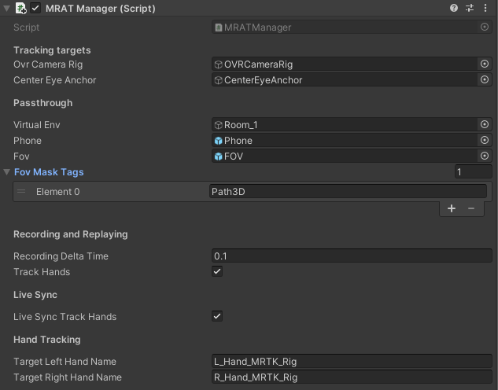

# MRAT-Passthrough
# About
MRAT-Passthrough is an user testing toolkit for Quest XR environment. This toolkit captures users performing certain tasks and allow UX designers and XR developers to analyze user behaviors both synchronously or asynchronously. This tool kits provides:
- Local and online recording and replaying function with head and hand position
- Live head and hand tracking from other devices (PC, Quest, Web browser)
- Mode switching function:
  - VR mode
  - Passthrough mode
  - Handheld mobile mode

# Environment setup
MRAT-Passthrough packages can be installed to an existing project for analysis purpose.  
⚠: **Please make sure** you have backup your original project before importing MRAT-Passthrough as it may interfere the original project setup. 
## MRAT-Passthrough
1. Download packages from the MRAT-Release folder or from [here](./MRAT-Release).
1. Import MRAT-Passthrough package to your project by double clicking or using package manager in Unity.

## MRTK installation
1. Download Mixed Reality Feature Tool from [Microsoft](https://www.microsoft.com/en-us/download/details.aspx?id=102778).
1. During the installation, select to install the following packages:
   - Mixed Reality Toolkit Examples
   - Mixed Reality Toolkit Extensions
   - Mixed Reality Toolkit Foundation
   - Mixed Reality Toolkit Standard Assets
1. After installation, restart Unity if needed.

## Oculus integration installation
1. Add Oculus Integration to your Unity from [Unity asset store](https://assetstore.unity.com/packages/tools/integration/oculus-integration-82022)
2. In Unity, open package manager. Search for Oculus Integration that has been added, then click **download** and then click **import**.

## Configure the project
1. In drop down menu `File -> Build Settings`, choose Android and switch platform.

## Configure the Oculus Integration
1. In asset window, search for OVRCameraRig. It should be located in `assets/Oculus/VR/Prefabs`.
1. Drag OVRCameraRig into the scene.
1. In `OVRCameraRig` object, set `Display -> Color Gamut` to `Quest`.
1. Restart Unity if needed, otherwise `Quest Features` may not appear in `OVRCameraRig`.
1. In `OVRCameraRig -> Quest Features`, set `hand tracking support` to `hands and controllers`.
1. In asset window, search OVRHandPrefab. It should be located in `assets/Oculus/VR/Prefabs`.
2. Drag OVRHandPrefab twice to the scene and set one of them to be a child of `LeftHandAnchor` and `RightHandAnchor` under `OVRCameraRig`.
3. Set all `hand type`, `skeleton type`, `mesh type` within `OVRHandPrefab` under `RightHandAnchor` to `Hand right`.
1. For the two `OVRHandPrefab`, set the following components to be inactive:
   - OVR Skeleton Renderer
   - OVR Mesh
   - OVR Mesh Renderer
   - Skinned Mesh Renderer
1. Under `OVRCameraRig`, choose add components, then search OVRPassthroughLayer and add that to `OVRCameraRig`.
2. In drop down menu `Oculus -> tools`, create android_manifest.xml. If it already exits, then use update android_manifest.xml.

## Configure MRTK
1. In Unity drop down menu `Mixed Reality -> toolkit -> Utilities`, use `Configure Project for MRTK` to configure.
2. In the MRTK configuration pop up window, select `Use Unity built-in pipeline (non-OpenXR)`.
3. Integrate Oculus modules. In Unity drop down menu `Mixed Reality -> toolkit -> Utilities`, use `Integrate Oculus integration unity modules`
4. Add MRTK to scene.  In Unity drop down menu `Mixed Reality -> toolkit`, use `Add to scene and configure`.

## Configure Firebase
1. In [Firebase](https://console.firebase.google.com), create your project.
2. Create a unity project in the main project overview menu. Please make sure the package name match the one you use for your Unity project.
3. Create a real time database.
4. Download google-services.json in setting panel.
5. Place the google-services.json in Asset folder in your Unity project.
6. Download and import firebase SDK from [Firebase Unity SDK](https://firebase.google.com/download/unity?authuser=0).
7. Within the firebase SDK, install the following packges:
   - FirebaseAuth
   - FirebaseDatabase
   - FirebaseFirestore

You can also check [Firebase tutorial](https://firebase.google.com/docs/unity/setup?authuser=0) for details.

## Configure the MRAT-Passthrough
To use MRAT-Passthrough, look for `MRAT` prefab in prefab folders and drag it to the scene.

MRAT-Passthrough have provided an easy configuration manager MRATManager attached to the `MRAT` game object. Please keep in mind that apart from `Function testing` session in MRATManager, modification on other sessions won't have effect in runtime as they are only passed to its children managers at start. If you want to change certain variables in runtime, please go to children of MRAT and adjust the values.

VirtualEnv is the virtual environment the player is in. It will be disabled when passthrough mode is on.

FOV is to simulate a head based AR device. To set up the FOV, place FOV prefab as child of `CenterEyeAnchor` under `OVRCameraRig`. Things that should be displayed only within FOV should be set to certain tags and enter the tags under `MRATManager -> FOV Mask Tags`.

Phone is to simulate a hand held AR device. To set up the phone, place Phone prefab as child of `OVRHandPrefab` under `OVRCameraRig`.

After configuration, OVRCameraRig should have hierarchy tree as following:
```
OVRCameraRig
    TrackingSpace
        LeftEyeAnchor
        CenterEyeAnchor
            FOV
        RightEyeAnchor
        TrackerAnchor
        LeftHandAnchor
            LeftControllerAnchor
            OVRHandPrefab
        RightHandAnchor
            RightControllerAnchor
            OVRHandPrefab
                Phone
```

TargetLeftHandName and TargetRightHandName is the name of the hand object that will be spawned automatically by MRTK in Unity. Please change the name if your MRTK generates different name for hand rig. 

The MRATManager should look like:



# For Further Development
## Add New Menu
To add a new panel in detailed window, create a new button under `MRAT -> MixedRealitySceneContent -> MainPanel -> Detailed Panel -> FunctionSelection` down to the items in viewport. See how other buttons do as examples. Then create a new menu page under `MRAT -> MixedRealitySceneContent -> MainPanel -> Detailed Panel -> Function`. Follow other panel's implementation.   
In `ControlManager`, add new items to both key and val in order, and the menu mapping will be set up.

## Trigger New Events
To trigger an event, call `TriggerEvent(string text, int level = 0)` in `MRATManager` class. The detailed explanation is in notes.

# Experimental Functions
## Avatar
This project is embedded with Oculus Avatar SDK and have fully functioning scripts that support the avatar function. However, the function is not enabled for convenient installation to other projects. If the avatar function is needed, please follow the steps below:

1. Open `avatarPrefab` as prefab, set `AvatarSdkManagerHorizon` and `AvatarEntity` to active. Save prefab.
1. In `MRATManager`, make sure the `avatarPrefab` and `useAvatar` is set to public. Then in unity inspector panel, find the `MRATManager`. Drag the Avatar prefab in Prefab folder to the `avatarPrefab`. Set the `useAvatar` to be true.